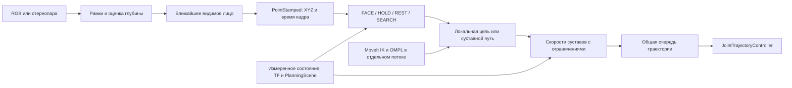

# Архитектура и интерфейсы

## Поток данных

Режим FACE сопровождает лицо; HOLD останавливает движение после краткой потери;
REST возвращает руку в исходную позу; SEARCH задаёт ограниченный обзор.
По умолчанию после 0.5 с без измерения выбирается HOLD, после 2 с — REST или
SEARCH. Отдельный watchdog исполнителя проверяет поступление команд с таймаутом
0.1 с. Время команды не подменяет время наблюдения лица.

Контроллер рассчитывает движение каждые 10 мс. Направление экрана имеет больший
приоритет, чем точность его положения. Пределы скорости, ускорения, рывка,
суставных углов и приближения к препятствиям ограничивают допустимые команды.
Для возвращения и смены позы фоновый планировщик выдаёт геометрический путь;
он проходит через тот же исполнитель и очередь, что обычное слежение.

## Границы модулей

| Модуль | Ответственность |
| --- | --- |
| `python/face_tracking_perception/detectors.py` | Инференс YuNet/ONNX, рамки в пикселях |
| `depth_geometry.py`, `depth_backends.py`, `rectification.py` | Геометрия камеры, глубина, выравнивание изображений |
| `face_selection.py` | Подтверждение наблюдений, сопоставление положений, выбор ближайшего лица |
| `node.py`, `depth_node.py` | ROS-изображения, синхронизация, TF, публикация точек и диагностики |
| `python/face_tracking_bringup/` | Проверка конфигурации и сборка аппаратного запуска |
| `tracking_core.*`, `face_tracking_component.cpp` | Желаемое положение экрана, режимы, входная точка и готовность ROS-контракта |
| `motion_reference.*`, `idle_search.*` | Выбор цели или пути, смена режимов и обзор |
| `tracking_velocity_task.*`, `target_motion_estimator.*` | Задача слежения и оценка движения цели |
| `background_path_planner.*`, `joint_path_follower.*` | Фоновый MoveIt-путь и продвижение по нему |
| `hierarchical_velocity_qp.*`, `collision_constraints.*` | Решение задачи скоростей и ограничения столкновений |
| `emergency_brake_tail.*`, `control_time_grid.*`, `published_trajectory_history.*` | Тормозной участок, общая временная сетка, контроль опубликованных команд |
| `collision_aware_servo_*` | Один ROS-компонент: цикл управления, обратная связь, очередь, восстановление и диагностика |
| `docker/host.py`, `docker/runtime.py` | Передача устройств и файлов в Docker, калибровка и вызов launch-файлов |

Части `collision_aware_servo_*` имеют одного владельца состояния. Общий header
находится в `src/` и не является публичным API. Они разделены по обязанностям;
вычислительные классы тестируются отдельно от работающего ROS-графа.

При завершении контейнер сначала останавливает ROS-callbacks. До закрытия
ROS-контекста компонент присоединяет рабочие потоки и освобождает MoveIt,
который хранит ссылки на родительский узел. Затем контейнер выгружает компоненты.

## Основные ROS-интерфейсы

| Интерфейс | Тип / назначение |
| --- | --- |
| `/face/center` | `geometry_msgs/PointStamped`: выбранное лицо в метрах, с исходным временем измерения |
| `/servo_node/tracking_target_cmds` | `face_tracking_arm/msg/TrackingTarget`: режим, поза, лицо и время измерения |
| `/servo_node/pose_target_cmds` | `geometry_msgs/PoseStamped`: совместимый вход позы |
| `/lite6_arm_controller/joint_trajectory` | `trajectory_msgs/JointTrajectory`: команды суставов |
| `/lite6_arm_controller/controller_state` | Обратная связь JointTrajectoryController |
| `/tracking/diagnostics` | Готовность, режим, принятые и отклонённые цели |
| `/servo_node/diagnostics` | Время расчёта, ограничения, торможение, восстановление |
| `/face_test/depth_status` | Качество оценки точки, число лиц, выбранная цель и возраст кадра |

Преобразования TF выполняются на время измерения. При отсутствии подходящего
TF используется короткое неблокирующее ожидание последнего наблюдения;
просроченные данные отбрасываются. Потеря лица означает отсутствие новой точки,
поэтому потребитель обязан проверять её возраст.

В симуляции все узлы используют `use_sim_time`. Аппаратные запуски используют
системное время. Оси камеры и единицы описаны в [руководстве по камерам](cameras.md).

## Конфигурация движения

Для оборудования редактируется [hardware.yaml](../config/hardware.yaml).
Для симуляции и разработки:

| Файл | Содержание |
| --- | --- |
| `config/tracking.yaml` | Желаемое расстояние, рабочая область, таймауты и TF |
| `config/moveit/collision_aware_servo.yaml` | Задача наведения, цикл управления, очередь, поиск и планирование |
| `config/moveit/joint_limits.yaml` | Рабочие пределы скорости, ускорения и рывка |
| `config/control/controllers.yaml` | Контроллеры ros2_control |

Custom backend принимает параметры `joint_centering_*`, `collision_avoidance_*`,
`lower_singularity_threshold`, `hard_stop_singularity_threshold`,
`singularity_recovery_gain` и `singularity_gradient_step_rad` для совместимости
с пользовательскими конфигурациями. Они не влияют на движение и не включены
в основной YAML. Жёсткие ограничения столкновений и суставов действуют независимо
от них. Настройки сингулярностей в `config/moveit/servo.yaml` относятся к
стандартному MoveIt Servo и действуют при `servo_backend:=standard`.

`servo_backend:=standard` в симуляции оставлен для сравнения с MoveIt Servo.
Основные сценарии используют `collision_aware`.

## Ограничения кинематики

Заводские ограничения Lite 6 сохраняются. Углы ограниченных суставов не
оборачиваются по модулю полного оборота: физически это разные состояния.
Поэтому длительный обход человека вокруг основания может потребовать
обратного разворота руки.

Перестройка позы учитывает движение цели и приближение к границе сустава.
Неподвижная цель сама по себе не запускает перестройку из-за накопленного угла.
Локальный контроллер может замедляться, когда требуемое движение несовместимо
с ограничениями. Плавность не означает одинаковую скорость во всех положениях.

PlanningScene содержит описанную геометрию робота, экрана, камеры и стола.
Карта окружающих предметов из изображения автоматически не строится.
