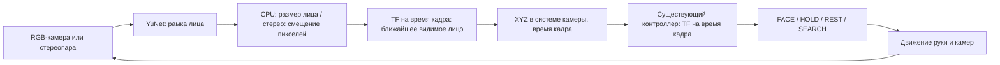

# Обнаружение лица и управление рукой

Два сценария для Gazebo Harmonic и ROS 2 Jazzy: Lite 6 с монитором, камерой
над его верхним краем и полноразмерным человеком перед столом. YuNet находит
лицо в изображении, выбранный способ оценивает XYZ, контроллер
подстраивает руку под измеренную точку.

## Запуск

Сначала выполните [сборку пакета](../CONTRIBUTING.md) и
[подготовку отдельного теста](face_detection_test.md).
Дополнительные веса для этих двух запусков не нужны.

```bash
cd ~/ros2_ws
source /opt/ros/jazzy/setup.bash
colcon build --base-paths src/face_tracking_arm --packages-select face_tracking_arm \
  --cmake-args -DCMAKE_EXPORT_COMPILE_COMMANDS=ON -G Ninja
source install/setup.bash
ros2 launch face_tracking_arm tracking_cpu.launch.py
```

Для стерео остановить предыдущий запуск через Ctrl+C и выполнить:

```bash
ros2 launch face_tracking_arm tracking_stereo.launch.py
```

Открываются Gazebo с рукой и человеком и RViz с изображением камеры,
рамкой лица, моделью руки и зелёной 3D-точкой. В CPU над монитором небольшой
чёрный корпус с одним объективом, в стерео — планка с двумя объективами.
`headless:=true` отключает оба окна, `show_image:=false` — только RViz.
Закрытие окна Gazebo завершает сценарий; Ctrl+C завершает весь запуск.

## Последовательность целей

Сначала рука стоит в REST. Через минимум 8 секунд появляется человек:

| Появление | Координаты ног X, Y от основания, м | Направление |
|---|---|---|
| 1 | 2.35, 0.00 | Прямо перед рукой |
| 2 | 2.25, −0.35 | Спереди справа |
| 3 | 2.60, +0.40 | Спереди слева |

Человек стоит на полу, центр лица примерно на высоте 1.77 м. Используется
одна текстурированная модель OSRF, повёрнутая лицом к руке. Положения выбраны
так, чтобы целое лицо попадало в кадр уже из исходной позы. При слишком
близком высоком человеке камера, исходно направленная горизонтально,
может видеть только туловище.

Каждое появление длится **12 секунд симуляционного времени**. Затем человек
скрывается: после потери измерений рука переходит в HOLD, затем в REST.
Перед следующей целью проходит **минимум 8 секунд**, дополнительно проверяются
исходные углы всех шести суставов, малая скорость и готовность управления.
Если возврат занимает дольше, сценарий ждёт. После третьей позиции цикл
повторяется. `cycles:=1` показывает каждую позицию один раз и оставляет
руку возвращаться в REST; сам Gazebo остаётся открыт.

Пока человек виден, он плавно движется около своей позиции: до ±14 см в
стороны, ±7 см ближе/дальше и примерно ±4° поворота относительно направления
на руку. Колебания имеют разные периоды: 6, 8.4 и 9.6 секунды; в первую
секунду движение нарастает плавно. Модель цельная, без скелета: перемещается
весь человек по полу, отдельной анимации шеи и шага нет.
Поза обновляется до 30 раз в секунду по симуляционному времени. Одновременно
в работе только одна группа запросов Gazebo, по одному на человека;
старые промежуточные позы не копятся.
Обновления движения не продлевают 12-секундную видимость цели.

```bash
ros2 launch face_tracking_arm tracking_stereo.launch.py \
  visible_sec:=15 rest_sec:=10 cycles:=1
```

Положения находятся в `config/face_appearances.yaml` как пары X, Y.
Там же задаются `motion_lateral_m`, `motion_depth_m`, `motion_yaw_rad` и
`motion_period_sec`. Нулевые три амплитуды возвращают неподвижные цели;
период должен оставаться положительным. После изменения исходного YAML нужно пересобрать пакет. Смена поз модели
производится сервисом Gazebo; координаты сценария не передаются детектору
или кинематическому контроллеру.

## Поиск и несколько лиц

В обоих запусках доступен параметр `idle_behavior`:

| Значение | Поведение после потери лица |
|---|---|
| `rest` (по умолчанию) | Возврат в исходную позу |
| `search_sweep` | Переход в компактную позу с камерой примерно на 20° вверх, затем обзор туда-обратно |
| `search_local_then_sweep` | Сначала до 6 с осмотра рядом с последней позой, затем широкий обзор; при старте без лица сразу широкий |

```bash
ros2 launch face_tracking_arm tracking_cpu.launch.py \
  idle_behavior:=search_local_then_sweep people_count:=2
```

Эти же параметры принимает `tracking_stereo.launch.py`. Параметры поведения читаются при старте; для смены режима перезапустите сценарий.
Одиночное лицо остаётся вариантом по умолчанию (`people_count:=1`). С двумя
людьми второй появляется сбоку и дальше первого, затем плавно подходит ближе.
Оба стоят на полу, их лица на человеческой высоте, оба немного двигаются.

В режиме поиска следующее появление ждёт готовности обзора, а не REST.
Отсчёт 12 с видимости начинается после первого обнаружения: человек остаётся
в сцене, пока камера смотрит в другую сторону. Если за 60 с он не найден,
сценарий скрывает его и увеличивает `discovery_timeouts` в диагностике.

После последнего кадра: до 0.5 с FACE, затем HOLD,
через 2 с без новых измерений — выбранное поведение ожидания. Поиск задаёт
цели общему исполнителю; смена SEARCH/FACE не сбрасывает его положение,
скорость, ускорение или опубликованный общий участок очереди. Короткая
подготовка позы обзора выполняется через существующий фоновый MoveIt-планировщик.
Сам обзор не требует постоянного перепланирования.

Настройки в `config/moveit/collision_aware_servo.yaml`: `search_speed_rad_s`
(0.30 rad/s), `search_sweep_half_range_rad` (2.80),
`search_local_half_range_rad` (0.35), `search_local_duration_sec` (6.0).
Полный проход ограничен примерно 321° первого сустава, туда и обратно;
интервал привязан к углу входа и сдвигается внутрь настоящих ограничений Lite 6.
Обороты не накапливаются, описание заводских пределов не менялось.
Обзор горизонтальный на одной высоте наклона: это не полный осмотр всех
возможных высот, а поиск лиц стоящих людей вокруг стола.

Выбирается ближайшее из **видимых лиц с пригодной оценкой глубины**, по
расстоянию от основания. Новое обнаружение подтверждается тремя кадрами
(минимум 60 мс). Текущее лицо сопоставляется по положению в неподвижной
системе основания, поэтому поворот камеры сам по себе не меняет цель.
Переключение требует, чтобы другое лицо было ближе минимум на 25 см или 10%
расстояния — берётся больший порог — в течение 0.4 с. Это предотвращает
метания между людьми на почти одинаковом расстоянии. Порог и время задаются
параметрами perception-узла `switch_margin_m`, `switch_delay_sec`.
Это сопоставление точек, без распознавания личности; пересечение людей и
долгое перекрытие могут привести к новому выбору. Для CPU неточной остаётся
сама оценка расстояния по ширине лица.

Подтверждение учитывает фактический интервал между кадрами, включая кадры без
лиц. Одиночная задержка не меняет оценку частоты; пауза более 1.5 с требует
нового подтверждения. Проверка возраста кадров и тайм-ауты движения действуют
независимо от частоты обнаружения.

## Камеры и данные

Один/два RGB-сенсора: 640×480, 30 Гц, горизонтальный угол обзора 60°.
Стереобаза по умолчанию 8 см, задаётся `baseline:=0.08`. Геометрия, TF и
CameraInfo используют одну базу. Камеры закреплены на мониторе и движутся
с ним. Корпус учитывается при проверках столкновений руки. В симуляции
используется упрощённая геометрия корпуса с массой 30 г.



Единственный источник `/face/center` — `face_position`. Это
`geometry_msgs/PointStamped` в `face_test_camera_optical_frame`, метры;
время сообщения совпадает со временем изображения. Существующий
`FaceTrackingComponent` преобразует измерение в world на это же время.
Синтетический источник точек и красный Gazebo-маркер отключены.
Газебовская карта глубины и координаты человека для оценки не используются.

Дополнительные выходы:

- `/face_test/debug_image`: изображение, выбранная рамка зелёная, остальные оранжевые;
- `/face_test/center_world`: та же измеренная точка в world для наблюдения;
- `/face_test/depth_status`: глубина, `valid_faces`, `selected_track_id`,
  `selected_distance_m`, `observation_drops`; номер track не является личностью;
- `/face_test/scenario`: фаза появления, номер и ожидание возврата;
- `/tracking/diagnostics`, `/servo_node/diagnostics`: состояние управления.

Изображения и CameraInfo синхронизируются по точному stamp; размер буфера — четыре сообщения. При потере лица
новые точки не публикуются. Позы движущейся камеры иногда приходят позже
изображения: выбор лица повторяет неблокирующий поиск TF для последнего
измерения, максимум до возраста 0.2 с. Точка публикуется после выбора,
с исходными координатами камеры и временем кадра. Просроченные наблюдения
отбрасываются; очередь старых точек не накапливается.

Камера находится выше центра экрана, поэтому лицо может быть немного ниже
центра её изображения, когда сам экран уже правильно направлен на человека.

## Параметры и ограничения

`detector:=yunet` выбран по умолчанию; рабочая альтернатива — `yolov5n_face`.
`yolo_facev2n` запускается, но обнаружений в проверенном checkpoint
не дал. `threads:=2`, `confidence:=0.6`, `face_width_m:=0.16` и пути
`model_dir`, `assets_dir`, `python_executable` сохранены из отдельных тестов.

CPU считает глубину по принятой ширине лица 16 см. Это приблизительная
оценка, зависящая от размера головы, поворота и рамки. Стерео использует
OpenCV StereoSGBM и два изображения; нейросеть глубины не нужна. Оба метода
работают на CPU, хотя сам Gazebo использует графику для отрисовки камер.
На кадр считается одна карта стерео, независимо от числа лиц. Затем глубина
вычисляется в каждой пригодной рамке и выбирается ближайшая устойчивая цель.

Проверяется зрительное сопровождение, а не избегание человека как препятствия:
его тело пока не добавлено в MoveIt PlanningScene. Далёкие лица также находятся
за пределами досягаемости руки: экран приближается насколько позволяет
контроллер и направляется на лицо, но не достигает 40 см до него.
Для настоящего стерео понадобятся калибровка, выравнивание и синхронизация
изображений. Модель человека используется с лицензией CC BY 3.0 и атрибуцией;
[источники ресурсов](../THIRD_PARTY_NOTICES.md).
