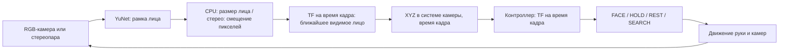

# Обнаружение лица и управление рукой

Два сценария для Gazebo Harmonic и ROS 2 Jazzy: xArm6 с монитором, камерой
над его верхним краем и полноразмерным человеком перед столом. YuNet находит
лицо в изображении, оценка глубины определяет его положение в 3D,
а контроллер направляет экран к измеренной точке.

## Запуск

Сначала выполните [сборку пакета](../CONTRIBUTING.md) и
[подготовку отдельного теста](face_detection_test.md).
Дополнительные веса для этих двух запусков не нужны.

```bash
cd ~/ros2_ws
source /opt/ros/jazzy/setup.bash
colcon build --base-paths src/face_tracking_arm --packages-select face_tracking_arm \
  --cmake-args -DCMAKE_EXPORT_COMPILE_COMMANDS=ON -G Ninja
source install/setup.bash
ros2 launch face_tracking_arm tracking_cpu.launch.py
```

Для стерео остановите предыдущий запуск через Ctrl+C и выполните:

```bash
ros2 launch face_tracking_arm tracking_stereo.launch.py
```

Открываются Gazebo с рукой и человеком и RViz с изображением камеры,
рамкой лица, моделью руки и зелёной 3D-точкой. В CPU над монитором небольшой
чёрный корпус с одним объективом, в стерео — планка с двумя объективами.
`headless:=true` отключает оба окна, `show_image:=false` — только RViz.
Закрытие окна Gazebo завершает сценарий; Ctrl+C завершает весь запуск.

## Выбор сценария

| `scenario` | Что проверяет | Начальная поза и поведение без лица по умолчанию |
| --- | --- | --- |
| `appearances` | Поочерёдные появления и небольшие движения людей перед рукой | `start_pose:=rest`, `idle_behavior:=rest` |
| `stress` | Выход из сложной позы, изменение высоты, широкие проходы и повторный захват | `start_pose:=zero`, `idle_behavior:=search_local_then_sweep` |
| `stress_fast` | Быстрые движения, приближение/удаление и выбор ближайшего из трёх людей | `start_pose:=rest`, `idle_behavior:=search_local_then_sweep` |
| `stress_close` | Очень близкий человек: отступление экрана, движения рядом и отход | `start_pose:=rest`, `idle_behavior:=search_local_then_sweep` |

Без дополнительных аргументов запускается сценарий `appearances`.
Параметры `robot_model`, `start_pose` и `initial_positions_file` доступны
во всех сценариях. Модель по умолчанию — `xarm6`.

## Быстрые движения и фоновые лица

```bash
ros2 launch face_tracking_arm tracking_cpu.launch.py scenario:=stress_fast cycles:=1
```

После остановки через Ctrl+C тот же тест со стереокамерой:

```bash
ros2 launch face_tracking_arm tracking_stereo.launch.py scenario:=stress_fast cycles:=1
```

Три человека находятся в сцене с начала запуска. Основной двигается,
два фоновых стоят по сторонам на расстоянии около 3 м от основания.
`people_count:=3` подставляется автоматически. Начальная поза — `rest`;
для более сложного старта добавьте `start_pose:=zero` или `start_pose:=folded`.

| Время, с | Что происходит |
| --- | --- |
| 0–10 | Основной человек стоит перед рукой |
| 10–20 | Быстрые смены направления в стороны и изменения высоты лица |
| 20–34 | Подходит до 1.4 м от основания и останавливается |
| 34–56 | Отходит до 3.6 м и в сторону, затем стоит дальше фоновых людей |
| 56–76 | Возвращается ближе фоновых людей и останавливается |
| 76–96 | Возвращается в начальное положение и стоит |

На дальней остановке выбор должен перейти на ближайшее **видимое** фоновое
лицо, после возвращения — на основное. Паузы позволяют отличить устойчивый
выбор от краткой задержки переключения. Расстояния в расписании —
горизонтальный радиус от основания руки. Все движения непрерывные; скорость
манекена на быстрых участках достигает примерно 1.25 м/с. Ограничения
скорости руки остаются обычными. Центр лица меняет высоту примерно
от 1.6 до 1.9 м перемещением цельного манекена, без анимации приседания.

Полный цикл занимает 96 секунд симуляционного времени. `cycles:=1` оставляет
людей в финальных позах; `cycles:=0` повторяет цикл. Приблизительная глубина
CPU может влиять на выбор ближайшего — для сравнения используйте стерео.
В RViz выбранное лицо обведено зелёным. `/face_test/depth_status` показывает
число пригодных лиц (`valid_faces`), ID выбранной цели и оценённую дистанцию.

## Очень близкий человек

```bash
ros2 launch face_tracking_arm tracking_cpu.launch.py \
  scenario:=stress_close cycles:=1 point_smoothing:=true
```

Для стерео замените имя файла на `tracking_stereo.launch.py`.
Для сравнения без сглаживания используйте `point_smoothing:=false`.

Один человек сначала подходит к экрану, затем делает ещё один близкий подход,
двигается в стороны, меняет высоту лица и отходит. Заданная дистанция остаётся
**0.40 м от центра передней поверхности экрана до лица**. Дистанция — вторичная
задача контроллера: тест проверяет фактическое отступление и сохранение наведения,
а не предполагает заранее, что все позы позволяют точно выдержать 40 см.

| Время, с | Действие |
| --- | --- |
| 0–10 | Стоит перед рукой: радиус 2.1 м, высота лица около 1.75 м |
| 10–22 | Подходит до радиуса 1.0 м, лицо опускается до 1.55 м |
| 22–28 | Остановка перед тесным сближением |
| 28–32 | Подходит ещё на 25 см, до радиуса 0.75 м |
| 32–42 | Близкая остановка: экрану требуется отступить |
| 42–60 | Движется по близкой дуге от −30° до +30°, поднимает лицо до 1.70 м |
| 60–76 | Опускает лицо до 1.40 м и возвращается перед руку |
| 76–84 | Близкая остановка с низким лицом |
| 84–100 | Отходит до радиуса 1.0 м и останавливается |
| 100–120 | Возвращается на 2.1 м и стоит |

Радиус указан от основания до оси манекена; его лицо выступает к роботу ещё
примерно на 20–22 см. Поэтому при радиусе 0.75 м лицо находится примерно в
0.54 м от вертикальной оси основания. Это существенно ближе, чем в `stress_fast`.
Если экран останется в желаемой позе первого подхода, второй подход сократит
расстояние до лица примерно до 24 см: сцена действительно требует отхода назад.
Фактические расстояния зависят от измерений камеры и достигнутой позы руки.

Манекен остаётся полноразмерным. Высота лица меняется переносом всей модели,
как в `stress`; это не анимация приседания, ноги могут оказаться ниже пола.
Скорость движения невысокая — до 0.22 м/с. Полный цикл занимает 120 секунд;
`cycles:=1` оставляет человека в финальной позе, `cycles:=0` повторяет маршрут.
Другую начальную позу задаёт `start_pose`, например `start_pose:=folded`.

## Сглаживание точки лица

Доступны фильтр Калмана и One Euro. Запуск со стерео и фильтром Калмана:

```bash
ros2 launch face_tracking_arm tracking_stereo.launch.py \
  scenario:=stress_close cycles:=1 point_smoothing:=true \
  point_smoothing_method:=kalman
```

Для обычной камеры вариант с более сильным сглаживанием:

```bash
ros2 launch face_tracking_arm tracking_cpu.launch.py \
  scenario:=stress_close cycles:=1 point_smoothing:=true \
  point_smoothing_method:=kalman \
  point_kalman_measurement_std_m:=0.03 point_kalman_acceleration_std_mps2:=1.0
```

Шум глубины CPU вместе с прогнозом скорости может усилить раскачку руки.
Удержание цели и плавность нужно проверять вместе; более спокойная точка
сама по себе не означает более спокойное движение.
Для быстрых движений используйте `scenario:=stress_fast`.
Для сравнения с One Euro задайте `point_smoothing_method:=one_euro`;
это метод по умолчанию при `point_smoothing:=true`.
Без `point_smoothing:=true` сглаживание в симуляции отключено.
В аппаратных запусках выбор задаётся в YAML или аргументом
[`--point-filter`](hardware.md#выбрать-сглаживание-при-запуске).
Сглаживается выбранная точка в неподвижной системе координат основания;
контроллер и оценка скорости лица получают эту же сглаженную точку.
Зелёная 3D-точка показывает результат фильтра. Рамка и красная точка поверх
изображения камеры показывают исходный детектор и не сглаживаются.

One Euro сильнее подавляет шум при небольших движениях и ослабляет сглаживание
при быстрых. Калман оценивает положение и скорость: сначала прогнозирует
положение к следующему кадру, затем уточняет его по измерению. Используется
`cv2.KalmanFilter` из OpenCV; GPU не требуется.
Калман не исправляет систематическую ошибку глубины обычной камеры.

Оба фильтра начинают с нового измерения при смене выбранного человека,
разрыве более 0.25 с или сбросе времени; координаты разных людей не усредняются.
Выход сохраняет время кадра и систему координат камеры. При потере лица
новые точки по одному прогнозу не публикуются.

| Аргумент | По умолчанию | Назначение |
| --- | --- | --- |
| `point_smoothing` | `false` | Включить сглаживание |
| `point_smoothing_method` | `one_euro` | `one_euro` или `kalman`; действует при включённом сглаживании |
| `point_smoothing_min_cutoff_hz` | `1.5` | One Euro: меньше — сильнее сглаживание на остановках, больше задержка |
| `point_smoothing_beta` | `32.0` | One Euro: больше — слабее сглаживание при движении; единицы 1/м |
| `point_kalman_measurement_std_m` | `0.02` | Калман: ожидаемый шум каждой координаты, м; больше — меньше доверие измерению |
| `point_kalman_acceleration_std_mps2` | `1.5` | Калман: ожидаемые изменения скорости, м/с²; больше — быстрее реакция, слабее сглаживание |

Параметры Калмана положительные; это настройки доверия, не ограничения
скорости или ускорения человека/робота. Сначала сравните настройки из команд выше
на неподвижной цели, затем при старте, остановке и смене направления.
Слишком сильное сглаживание добавляет отставание; прогноз скорости может
дать краткий выход за точку остановки.
В `/face_test/depth_status` поля `raw_x_m/raw_y_m/raw_z_m` содержат исходную точку,
`x_m/y_m/z_m` — выходную; `point_smoothing_correction_m` — расстояние между ними.
`point_smoothing_method` показывает выбранный метод.

## Сложный маршрут и стартовые позы

Один прогон с обычной камерой, начиная с шести нулевых углов:

```bash
ros2 launch face_tracking_arm tracking_cpu.launch.py scenario:=stress cycles:=1
```

Тот же маршрут со стереокамерой:

```bash
ros2 launch face_tracking_arm tracking_stereo.launch.py scenario:=stress cycles:=1
```

Для сравнения повторите маршрут из сложенной позы или у границы первого сустава:

```bash
ros2 launch face_tracking_arm tracking_cpu.launch.py \
  scenario:=stress cycles:=1 start_pose:=folded

ros2 launch face_tracking_arm tracking_cpu.launch.py \
  scenario:=stress cycles:=1 start_pose:=joint1_limit
```

| `start_pose` | Начальные углы |
| --- | --- |
| `rest` | Обычная поза слежения из конфигурации |
| `zero` | J1–J6 равны нулю |
| `folded` | xArm6: `[354.3, −67.5, −15, −100.4, −60, 117.8]°` |
| `joint1_limit` | Обычная поза выбранной модели, но J1 = +359.9° |
| `incident` | Только Lite6: записанная поза `[354.3, −67.5, 20.3, −100.4, −91.6, 117.8]°` |

`folded` — поза xArm6 без пересечений с заданной в сцене геометрией экрана.
Для проверки старта Lite6 из позы `incident`:

```bash
ros2 launch face_tracking_arm tracking_cpu.launch.py \
  scenario:=stress cycles:=1 robot_model:=lite6 start_pose:=incident
```

**`incident` проверяет блокировку старта при столкновении.** С заданной
геометрией экрана P16 звенья `link1` и `monitor_link` пересекаются.
Ожидаемый результат — обнаружение пересечения и удержание руки.

Собственные углы можно задать через
`initial_positions_file:=/полный/путь/angles.yaml`. Этот файл имеет приоритет
над `start_pose`; формат и единицы — [шесть суставов в радианах](simulation.md).

Маршрут занимает **134 секунды симуляционного времени**:

| Время, с | Действие манекена |
| --- | --- |
| 0–20 | Стоит перед рукой на расстоянии 2.1 м от основания |
| 20–46 | Приближается, опускает и поднимает лицо, уходит по дуге до −100° |
| 46–66 | Проходит через переднюю область до +110° |
| 66–82 | Меняет направление и возвращается к +25° |
| 82–92 | Стоит неподвижно для проверки дрожания |
| 92–100 | Исчезает |
| 100–108 | Снова появляется сбоку, на −70° |
| 108–122 | Возвращается перед руку |
| 122–134 | Финальная неподвижная цель |

Радиус движения — 1.4–2.6 м, примерная высота центра лица — 1.25–1.85 м
от пола. Азимут отсчитывается от +X, положительное направление — к +Y.
Переходы плавные, лицо направлено к основанию робота. Высота меняется
вертикальным перемещением цельного тестового манекена: скелета и анимации
приседания нет, ноги могут оказаться ниже пола или над ним.

Человек присутствует в сцене с запуска. Расписание начинается с первой
обратной связи суставов, **не ждёт REST или обнаружения FACE** и продолжает
идти при отставании руки. В нулевой позе камера может смотреть вниз: сначала
проверяется выход в обзор, затем захват видимого лица.

`cycles:=1` оставляет манекен в конечной позе, а руку — сопровождать его;
Gazebo и RViz остаются открыты. `cycles:=0` повторяет маршрут без скачка
между концом и началом. `stress` рассчитан на `people_count:=1`;
`visible_sec` и `rest_sec` относятся только к `appearances`.

В `/face_test/scenario` поля `elapsed_sec`, фаза и `complete` описывают
расписание, а не успешное выполнение движений. Для проверки применения поз
нужны `pose_failures=0` и малый, не накапливающийся `pose_ack_age_sec`
(значение −1 означает, что подтверждений ещё нет). Сопровождение оценивайте
по изображению камеры и `/servo_node/diagnostics`: наведение, длительность
потерь, восстановление и остановка дрожания в неподвижных этапах.

## Последовательность целей

В сценарии `appearances` сначала рука стоит в REST. Через минимум 8 секунд
появляется человек:

| Появление | Координаты ног X, Y от основания, м | Направление |
|---|---|---|
| 1 | 2.35, 0.00 | Прямо перед рукой |
| 2 | 2.25, −0.35 | Спереди справа |
| 3 | 2.60, +0.40 | Спереди слева |

Человек стоит на полу, центр лица примерно на высоте 1.77 м. Используется
одна текстурированная модель OSRF, повёрнутая лицом к руке. Положения выбраны
так, чтобы целое лицо попадало в кадр уже из исходной позы. При слишком
близком высоком человеке камера, исходно направленная горизонтально,
может видеть только туловище.

Каждое появление длится **12 секунд симуляционного времени**. Затем человек
скрывается: после потери измерений рука переходит в HOLD, затем в REST.
Перед следующей целью проходит **минимум 8 секунд**, дополнительно проверяются
исходные углы всех шести суставов, малая скорость и готовность управления.
Если возврат занимает дольше, сценарий ждёт. После третьей позиции цикл
повторяется. `cycles:=1` показывает каждую позицию один раз и оставляет
руку возвращаться в REST; сам Gazebo остаётся открыт.

Пока человек виден, он плавно движется около своей позиции: до ±14 см в
стороны, ±7 см ближе/дальше и примерно ±4° поворота относительно направления
на руку. Колебания имеют разные периоды: 6, 8.4 и 9.6 секунды; в первую
секунду движение нарастает плавно. Модель цельная, без скелета: перемещается
весь человек по полу, отдельной анимации шеи и шага нет.
Поза обновляется до 30 раз в секунду по симуляционному времени. Одновременно
в работе только одна группа запросов Gazebo, по одному на человека;
старые промежуточные позы не копятся.
Обновления движения не продлевают 12-секундную видимость цели.

```bash
ros2 launch face_tracking_arm tracking_stereo.launch.py \
  visible_sec:=15 rest_sec:=10 cycles:=1
```

Положения находятся в `config/face_appearances.yaml` как пары X, Y.
Там же задаются `motion_lateral_m`, `motion_depth_m`, `motion_yaw_rad` и
`motion_period_sec`. Нулевые значения всех трёх амплитуд делают цели неподвижными;
период должен оставаться положительным. После изменения исходного YAML
пересоберите пакет. Смена поз модели производится сервисом Gazebo; координаты сценария не передаются детектору
или кинематическому контроллеру.

## Поиск и несколько лиц

В обоих запусках доступен параметр `idle_behavior`:

| Значение | Поведение после потери лица |
|---|---|
| `rest` (по умолчанию для `appearances`) | Возврат в исходную позу |
| `search_sweep` | Переход в компактную позу с камерой примерно на 20° вверх, затем обзор туда-обратно |
| `search_local_then_sweep` | Сначала до 6 с осмотра рядом с последней позой, затем широкий обзор; при старте без лица сразу широкий |

```bash
ros2 launch face_tracking_arm tracking_cpu.launch.py \
  idle_behavior:=search_local_then_sweep people_count:=2
```

Эти же параметры принимает `tracking_stereo.launch.py`. Параметры поведения читаются при старте; для смены режима перезапустите сценарий.
Одиночное лицо остаётся вариантом по умолчанию (`people_count:=1`). С двумя
людьми второй появляется сбоку и дальше первого, затем плавно подходит ближе.
Оба стоят на полу, их лица на человеческой высоте, оба немного двигаются.

В `appearances` с поиском следующее появление ждёт готовности обзора, а не REST.
Отсчёт 12 с видимости начинается после первого обнаружения: человек остаётся
в сцене, пока камера смотрит в другую сторону. Если за 60 с он не найден,
сценарий скрывает его и увеличивает `discovery_timeouts` в диагностике.

После последнего кадра: до 0.5 с FACE, затем HOLD,
через 2 с без новых измерений — выбранное поведение ожидания. Поиск задаёт
цели общему исполнителю; смена SEARCH/FACE не сбрасывает его положение,
скорость, ускорение или опубликованный общий участок очереди. Короткая
подготовка позы обзора выполняется через фоновый планировщик MoveIt.
Сам обзор не требует постоянного перепланирования.

Настройки в `config/moveit/collision_aware_servo.yaml`: `search_speed_rad_s`
(0.30 rad/s), `search_sweep_half_range_rad` (2.80),
`search_local_half_range_rad` (0.35), `search_local_duration_sec` (6.0).
Полный проход ограничен примерно 321° первого сустава, туда и обратно;
интервал привязан к углу входа и сдвигается внутрь заводских ограничений xArm6.
Обзор проходит в пределах допустимых углов суставов; обороты не накапливаются.
Обзор горизонтальный на одной высоте наклона: это не полный осмотр всех
возможных высот, а поиск лиц стоящих людей вокруг стола.

Выбирается ближайшее из **видимых лиц с пригодной оценкой глубины**, по
расстоянию от основания. Новое обнаружение подтверждается тремя кадрами
(минимум 60 мс). Текущее лицо сопоставляется по положению в неподвижной
системе основания, поэтому поворот камеры сам по себе не меняет цель.
Переключение требует, чтобы другое лицо было ближе минимум на 25 см или 10%
расстояния — берётся больший порог — в течение 0.4 с. Это предотвращает
метания между людьми на почти одинаковом расстоянии. Порог и время задаются
параметрами perception-узла `switch_margin_m`, `switch_delay_sec`.
Это сопоставление точек, без распознавания личности; пересечение людей и
долгое перекрытие могут привести к новому выбору. Для CPU неточной остаётся
сама оценка расстояния по ширине лица.

Подтверждение учитывает фактический интервал между кадрами, включая кадры без
лиц. Одиночная задержка не меняет оценку частоты; пауза более 1.5 с требует
нового подтверждения. Проверка возраста кадров и тайм-ауты движения действуют
независимо от частоты обнаружения.

## Камеры и данные

RGB-сенсор: 1280×720; стереопара: 640×360, чтобы уменьшить время расчёта глубины.
Оба режима: 30 Гц, горизонтальный угол обзора около 82°
(приближение BRIO с диагональным обзором 90°). Разрешение меняется аргументами
`camera_width`, `camera_height`, частота — `camera_rate`, горизонтальный обзор
в радианах — `camera_horizontal_fov`. Это параметры симуляции;
`hardware.yaml` настраивает аппаратные запуски, где исходный режим — 640×480.
Стереобаза по умолчанию 8 см, задаётся `baseline:=0.08`. Геометрия, TF и
CameraInfo используют одну базу. Камеры закреплены на мониторе и движутся
с ним. Корпус учитывается при проверках столкновений руки. В симуляции
используется упрощённая геометрия корпуса с массой 65 г.



Единственный источник `/face/center` — `face_position`. Это
`geometry_msgs/PointStamped` в `face_test_camera_optical_frame`, метры;
время сообщения совпадает со временем изображения.
`FaceTrackingComponent` преобразует измерение в world на это же время.
Синтетический источник точек и красный Gazebo-маркер отключены.
Газебовская карта глубины и координаты человека для оценки не используются.

Дополнительные выходы:

- `/face_test/debug_image`: изображение, выбранная рамка зелёная, остальные оранжевые;
- `/face_test/center_world`: та же измеренная точка в world для наблюдения;
- `/face_test/depth_status`: глубина, `valid_faces`, `selected_track_id`,
  `selected_distance_m`, `observation_drops`; номер track не является личностью;
- `/face_test/scenario`: фаза появления, номер и ожидание возврата;
- `/tracking/diagnostics`, `/servo_node/diagnostics`: состояние управления.

Изображения и CameraInfo синхронизируются по точному stamp; размер буфера — четыре сообщения. При потере лица
новые точки не публикуются. Позы движущейся камеры иногда приходят позже
изображения: выбор лица повторяет неблокирующий поиск TF для последнего
измерения, максимум до возраста 0.2 с. Точка публикуется после выбора,
с исходными координатами камеры и временем кадра. Просроченные наблюдения
отбрасываются; очередь старых точек не накапливается.

В этих запусках контроллер следует по оптической оси камеры, поэтому лицо
стремится к центру кадра. Центр монитора находится ниже объектива.

## Параметры и ограничения

`detector:=yunet` выбран по умолчанию; рабочая альтернатива — `yolov5n_face`.
`yolo_facev2n` запускается, но обнаружений в проверенном checkpoint
не дал. `threads:=2`, `confidence:=0.6`, `face_width_m:=0.16` и пути
`model_dir`, `assets_dir`, `python_executable` совпадают с параметрами отдельных
тестов детектора.

CPU считает глубину по принятой ширине лица 16 см. Это приблизительная
оценка, зависящая от размера головы, поворота и рамки. Стерео использует
OpenCV StereoSGBM и два изображения; нейросеть глубины не нужна. Оба метода
работают на CPU, хотя сам Gazebo использует графику для отрисовки камер.
На кадр считается одна карта стерео, независимо от числа лиц. Затем глубина
вычисляется в каждой пригодной рамке и выбирается ближайшая устойчивая цель.

Тело человека не включено в MoveIt PlanningScene: сценарий проверяет
зрительное сопровождение и не обеспечивает обход человека как препятствия.
Далёкие лица находятся за пределами досягаемости руки: экран приближается насколько позволяет
контроллер и направляется на лицо, но не достигает 40 см до него.
Для настоящего стерео понадобятся калибровка, выравнивание и синхронизация
изображений. Модель человека используется с лицензией CC BY 3.0 и атрибуцией;
[источники ресурсов](../THIRD_PARTY_NOTICES.md).
